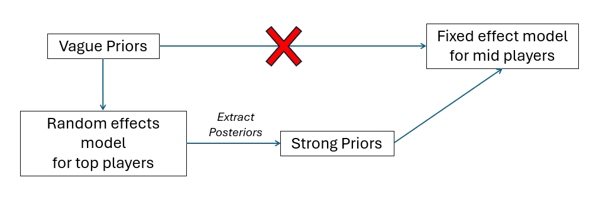
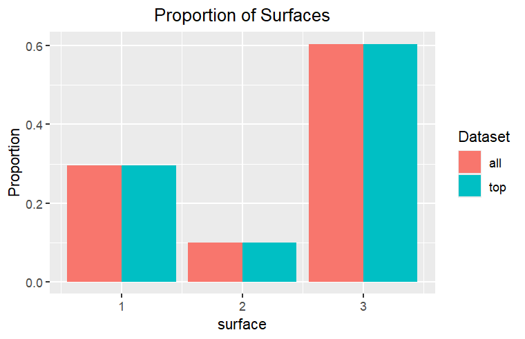
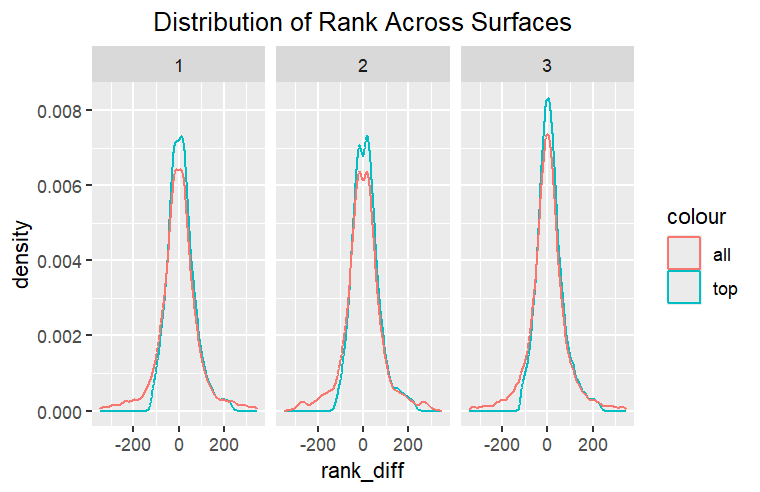
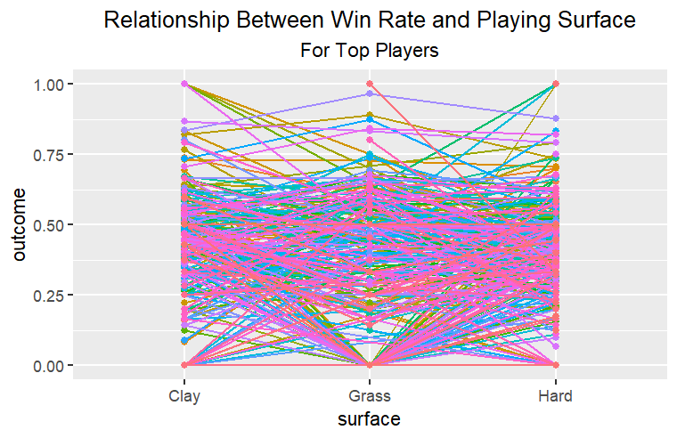
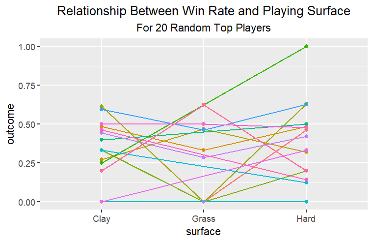
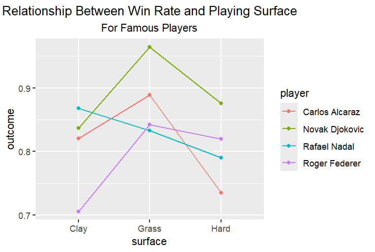
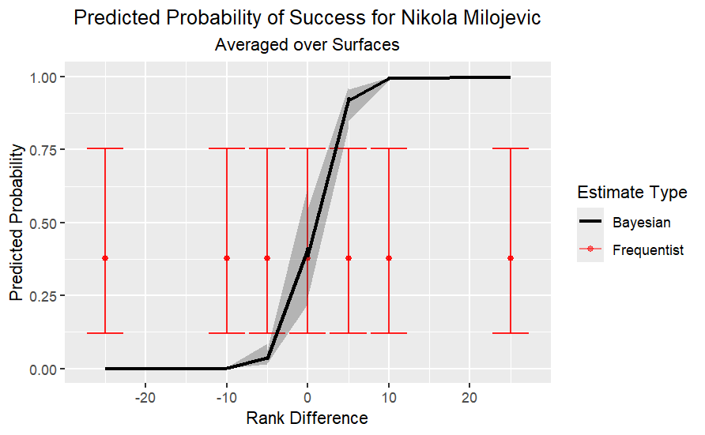
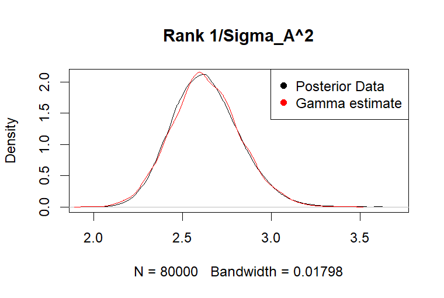
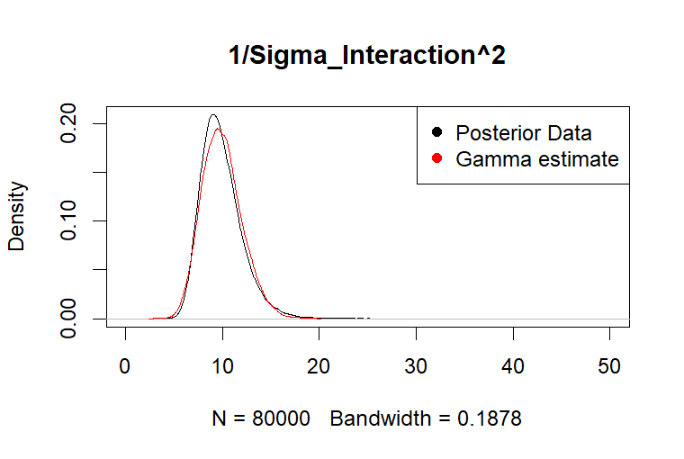

## Motivation

-   When you watch sports, it is more fun to pick someone to root for (we don't condone gambling)\
-   Casual tennis viewers struggle to pick a player to root for
-   Big stars are recognizable, but most players are unfamiliar
-   Choosing an underdog is appealing, but risky without the context of data
-   Goal: Build a simple, data-informed model for picking a "safe" underdog, designed for casual viewers

## Background

-   Want a model designed for casual viewers, not experts
-   Should ignore complex factors (play style, endurance, etc.)
-   Uses only what you can easily see or look up:
    -   Players
    -   Court surface
    -   ATP ranking

## Research Gap

-   Many tennis models require detailed data unavailable to casual fans
-   Simpler alternatives (regression, ELO, head-to-head) lack coverage for low-data players
-   None are designed specifically for players with limited match history
-   We can fill this gap with a Bayesian hierarchical model, borrowing strength across players

## Data

-   ATP matches 2019-2023 available from Sackmann public GitHub repository
-   Examine surface effect: Clay, Hard, and Grass
-   Key predictor: Rank difference (opponent - player)
-   "Top players": $\ge$ 50 matches
-   "Mid players": 10-49 matches

## Model (check this notation)

## Model Specifics

-   Outcome of each match: $Y_{ijk} \sim \text{Bernoulli}(p_{ijk})$ $\text{logit}(p_{ijk}) = A_i + \alpha_j + (\alpha A)_{ij} + \beta X_{ijk}$
    -   $A_i \sim N(0, \sigma^2_A)$: Player random effect (skill)
    -   $(\alpha A)_{ij} = B_{ij} \sim N(0, \sigma^2_{Aa})$: Player surface interaction
    -   $\beta, \alpha_i \sim N(0, 2^2)$: Vague priors on player match-up (rank difference) and surface effect
    - $\sigma^2_A, \sigma^2_B \sim$ Half Cauchy
-   Top-player posteriors used as informative priors for a fixed-effect mid-player model

## Model Assumptions

-   Top players are representative of the population
-   Mid and top players come from the same population
-   Players are mutually independent 

## Supplimentary Results: Surface & Rank Effects

-   SSVS determined that the surface effect is significant
-   Rank difference is a significant positive predictor of winning probability 
  - Prob$(\beta > 0) = 1$
-   DIC comparison between models to determine interaction is significant
  - Interaction DIC: 27820 | Additive DIC: 27927

## Data Interaction

  

## Results: Posterior Predictions for Single Player

-   Bayesian credible intervals are wider for mid-players than top players
-   Less data = More uncertainty
-   Frequentist GLM estimates give the same result as conjugate vague priors for Bayes
  - lacks shrinkage and is more extreme at tails
-   Plot shows frequentist (Vague Prior) vs Bayesian (Strong Prior) estimate for a single mid-player

## Posterior Predictions for Future Data

-   Data from the next year (2024), and selected the players we just modeled
-   We used our model to predict the outcome of these matches
-   Our model had an accuracy of 61.2% and a sensitivity (true positive) of 54.4%
-   This is ok, but much better than a model that does not pool strength from the top players
    -   The vague model had an accuracy of 55.9% but a sensitivity of only 18.4%!!

## Who Should You Root for? (Summary of Fixed Effects)

## Strengths & Limitations

-   Shrinkage improves stability for low-data players
-   Credible intervals communicate prediction uncertainty honestly
-   Rank difference along is a noisy signal, ignores form, injuries, and head-to-head
-   Could expand time frame to capture larger player pool, track players over time, or have an internal database of more complex predictors per player

# Programming Details (Extra Information Slides)

## Random effects Model
-   SSVS: `delta ~ dcat([1/3, 1/3, 1/3])`
    - Interaction: P(M1)=0.49, Additive: P(M2)=0.51, No fixed surface effect: P(M3)≈0
-   Priors on σ: Half-T(0,1,4) truncated at 0
- Samples confirmed to converge via Gelman-Rubin R-hat \< 1.05
- DIC: Interaction model 27820, Additive model 27927

## Extracting parameters
-   Variance hyperparameters fit via finding MLE of Gamma distribution likelihood built on top-player posteriors: Using method `optim(BFGS).`
 
- Normal hyperparameters extracted from summary statistics exactly, use mean and SD from the summary of MCMC.list$statistics
- Rank difference slightly lower/wider for mid players than top players
  - Restricted fixed effect model to only the observations with rank_diff within the center 95% of top_player rank_diff quantile(.025, .975)
   - Player "Martin Cuevas" had no data within this limit
  
## Fixed effect model
-   4 chains, 10k burn-in, 20k samples; 
- Samples confirmed to converge via Gelman-Rubin R-hat \< 1.05
-   Surface encoding: 1=Clay, 2=Grass, 3=Hard (alphabetical factor levels in R)
- For future predictions, we plugged the new values into the prediction formula rather than re-running JAGS (code on next slide)
## 
> d.grid = data.frame(mid_df_future |> select(-outcome),
                    Est=NA, Lower=NA, Upper=NA)
  for ( i in 1:nrow(d.grid) ){     
    surf = d.grid$surface[i]
    player = d.grid$player[i]
      mu = rez[,paste0("alpha[", surf, "]")] + 
      rez[,"beta"]*d.grid$rank_diff[i] +
    rez[,paste0("A[", player, "]")] + 
    rez[,paste0("B[", player, ",", surf, "]")]
  pr = 1/(1+exp(-mu))
  d.grid[i,c("Est", "Lower", "Upper")] = round(quantile(pr, p=c(0.5, 0.025, 0.975)), 3)
}
Results = data.frame(mid_df_future$outcome, d.grid)
